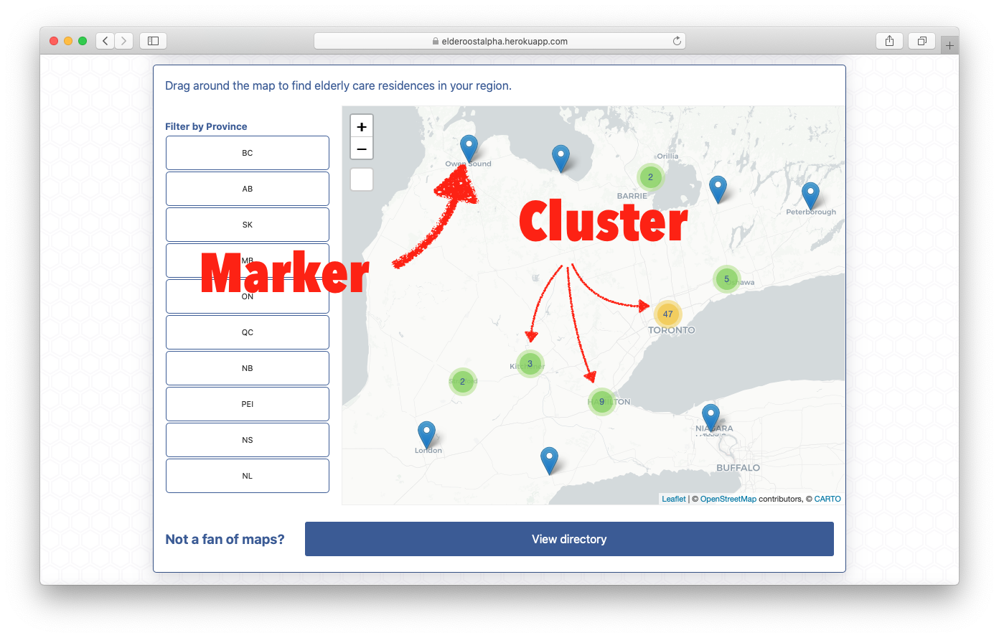
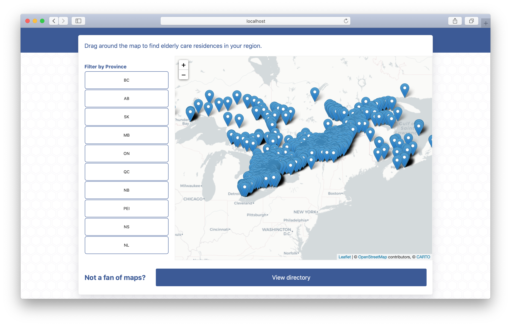
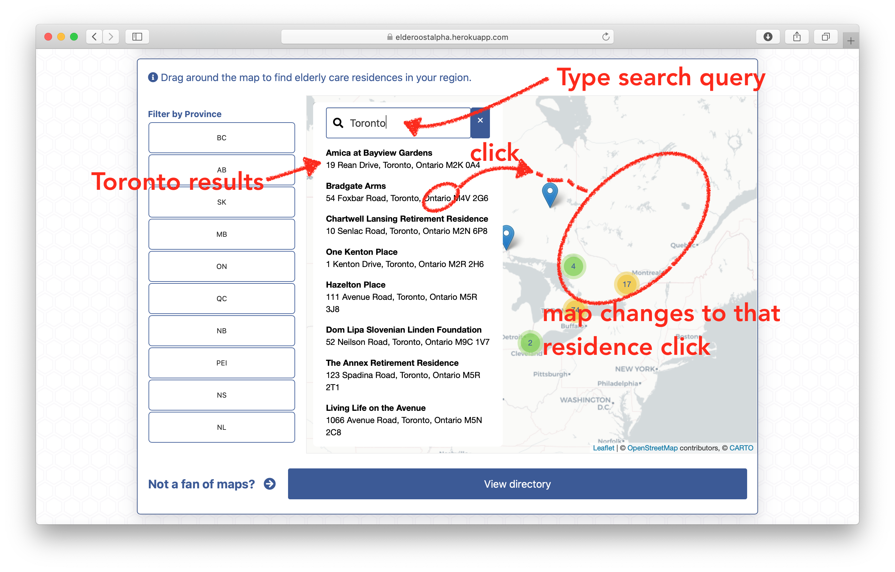

:::note NOTE
I will introduce you to GeoJSON format for passing data, Leaflet library for making maps, and Fuse for searching.
:::

[Leaflet](https://leafletjs.com/) is perhaps not only a map library but the main component that is used everywhere throughout the Elderoost project. After all, Elderoost is built to be heavily visual, accessible, and responsive. Leaflet API is nicely documented and comes with tons of additional plugins. Two of these plugins, one for clustering points together and the other for powerful searching, will be introduced in this chapter. I use this library on the main screen and on each individual residence screen.

## Leaflet.js

[Leaflet](https://leafletjs.com/) was selected as the default map library for my project because it just works, is open-source, and has a plethora of useful plugins. Creation of a map is simple, I just needed to imbed the following code in my handebarsjs page to request the library and its css code :

```handlebars title="views/index.hbs"
<link rel="stylesheet" href="https://unpkg.com/leaflet@1.6.0/dist/leaflet.css" integrity="sha512-xwE/Az9zrjBIphAcBb3F6JVqxf46+CDLwfLMHloNu6KEQCAWi6HcDUbeOfBIptF7tcCzusKFjFw2yuvEpDL9wQ==" crossorigin="" /> <1>
<script src="/javascripts/leaflet/leaflet.min.js"></script> <2>
```

- <1> Leaflet library has some default styling that needs to be imported for everything to work
- <2> The actual library is included with the source code for this book

Then I just needed to instantiate the map somewhere in the code; like this for example :

```handlebars title="views/index.hbs"
L.map("map", {
scrollWheelZoom: false
}).setView([45.416191, -75.691727], 5)
```

In the following section I will go through the construction of the map as it is shown above. The actual map is instantiated using GeoJSON data and grouped into clusters. In this section I simply wanted to show how easy it is to work with Leaflet library.

:::note [TIP]
See [index.hbs](introduction.md#viewsindexhbs) explanation
:::

## GeoJSON

[GeoJSON](https://geojson.org/) is a specification format that tells us of a way to represent geographic data in JSON object form. You can see the format below and it stores data in two ways: (i) single features and (ii) feature collections. A feature is a collection of data that describes a geographic object like a point or a shape. In this project, we will be using this format to work with our data and describe our map. By using a format, I can ensure some data integrity for the future as well because formats rarely change. This way we can structure our data however we want on the server and send it to the client UI to simply display.

In our project, there are several requirements when it comes to data attributes of a residence that I assume each one of the data points has : (i) name field, (ii) address field, (iii) latitude field, and (iv) longitude field. If you were looking just to experiment, I recommend having at least a name, latitude, and longitude attributes on a data model. The name field would be used as a separator.

For a single entry, our `Feature` object should look like so :

```json title="GeoJSON format for a Feature object"
{
  "type": "Feature",
  "properties": {
    "name": "Canterbury Place Retirement Residence",
    "address": "1 Canterbury Place, North York, Ontario M2N 0G7",
    "slug": "canterbury-place-retirement-residence-ontario-reviews"
  },
  "geometry": {
    "type": "Point",
    "coordinates": [-79.414597, 43.771693]
  }
}
```

From the code above you can see that I am expressing a single residence object by its specific properties such as name, address, and id slug; and by its geometry which is a simple point located at a specific longitude and latitude.

For a collection, more than 1, you simply wrap a bunch of these Feature objects in an array as a features property of the `FeatureCollection` object.

```json title="GeoJSON format for a FeatureCollection object"
{
  "type": "FeatureCollection",
  "features": [
    {
      "type": "Feature",
      "properties": {
        "name": "Canterbury Place Retirement Residence",
        "address": "1 Canterbury Place, North York, Ontario M2N 0G7",
        "slug": "canterbury-place-retirement-residence-ontario-reviews"
      },
      "geometry": {
        "type": "Point",
        "coordinates": [-79.414597, 43.771693]
      }
    }
  ]
}
```

The way that this data is then used in the following. Leaflet library has a constructor, a way to initiate the object, using GeoJSON data. This data must be in either `Feature` or `FeatureCollection` type.

So, during map construction, I make a call to my api that sends back the `FeatureCollection` object. Then, I simply feed the ready data in Leaflet’s constructor and the map with data points appears.

This is how the collection gets created on the server :

```js title=".routes/residences.js"
...
router.get("/api/", async (req, res, next) => {
  try {
    const residences = await Residence.findAll();
    if (residences) {
      const mapped = residences.map((residence) => {
        return {
          type: "Feature",
          properties: {
            name: residence.name,
            address: residence.address,
            slug: residence.slug,
          },
          geometry: {
            type: "Point",
            coordinates: [
              Number(residence.longitude),
              Number(residence.latitude),
            ],
          },
        };
      });
      const result = {
        type: "FeatureCollection",
        features: mapped,
      };
      res.send(JSON.stringify(result));
    }
  } catch (\_error) {
    console.error(`error in /api/ : ${_error}`);
    res.sendStatus(200);
  }
});
...

```

:::note [TIP]
See [index.hbs](introduction.md#viewsindexhbs) explanation for GeoJSON data injestion
:::

## Markers vs. Clusters



This section is mainly optional as it requires adding a plugin to your project, but I did implement it in my projet Elderoost. When I began working on the project, I did not have many data points. Thus, when I was working with the map I did not notice any performance issues nor did I have any issues with locating individual residences. However, as my data grew, so did my data points. The amount of data made my project look like this without any clustering on it :



With so many data points crowding the map, it became much harder to browse the map and get any value out of it. In addition, it took much more time for the map and all of the data points to be generated. Plus, while it was generating the map, the performance of the entire app became sluggish.

I went to the [plugin section](https://leafletjs.com/plugins.html) of leaflet’s library and came across the clustering markers solution, `leaflet.markercluster.js`. I quickly downloaded the library and set it up in the code. As soon as I refreshed the page, everything became clustered and the page performance felt much snappier.

To add clustering to our map is actually very simple. We first import the library plugin in the html:

```js title=".views/index.hbs"
// ...
<script src="/javascripts/leaflet-markercluster/leaflet.markercluster.js"></script>
// ...
```

and then we load the required css by the library :

```handlebars title="views/index.hbs"
<link rel="stylesheet" href="https://unpkg.com/leaflet.markercluster@1.4.1/dist/MarkerCluster.css"/>
<link rel="stylesheet" href="https://unpkg.com/leaflet.markercluster@1.4.1/dist/MarkerCluster.Default.css"/>
```

and finally put everything together in the handlebars template like so :

```handlebars title="views/index.hbs"
var newLayer = L.markerClusterGroup({ <1>
  chunkedLoading: true,
  showCoverageOnHover: false
});
newLayer.addLayer(geoJSONLayer); <2>
map.addLayer(newLayer); <3>
```

- <1> Instantiate the cluster group object
- <2> Add geoJSON data that will be clustered
- <3> Add everything to the map

There we have it. Now the marker points, that we previously had individually displayed, will be automagically grouped together as needed into clusters. By clicking on the cluster the user will then zoom in on that cluster area and individual markers from that cluster will then appear.

:::note [TIP]
See [index.hbs](introduction.md#viewsindexhbs) explanation
:::

## Search

The [leaflet-fusesearch](https://github.com/naomap/leaflet-fusesearch) plugin is very easy to integrate and it works extremely well out of the box with minimum configurations needed. For these reasons alone, I introduced this library and a new feature into my map. This is a second search feature in my project that allows a user to search in my UI. This search is specific to the leaflet library and depends on the provided data to be in geoJSON format. Please note that this library depends on the [Fuse.js](https://github.com/krisk/Fuse) fuzzy search library for its searching functionality. Therefore, we need to load fuse.js search prior to loading this search library.



The way that the search works is that it takes in geoJSON data during its instantiation and looks at each individual feature’s properties. In our case, each feature has a name, address, and slug properties. I have indexed each residence on its name and address properties. The slug property is useful for me only and it simply is used as an identifier for each residence during creation of a link. Thus, there is no need to search by the slug property.

When a user begins typing, the results field shows data that matches by either name or address [properties](introduction.md#viewsindexhbs).

:::note [TIP]
See [index.hbs](introduction.md#viewsindexhbs) explanation
:::
