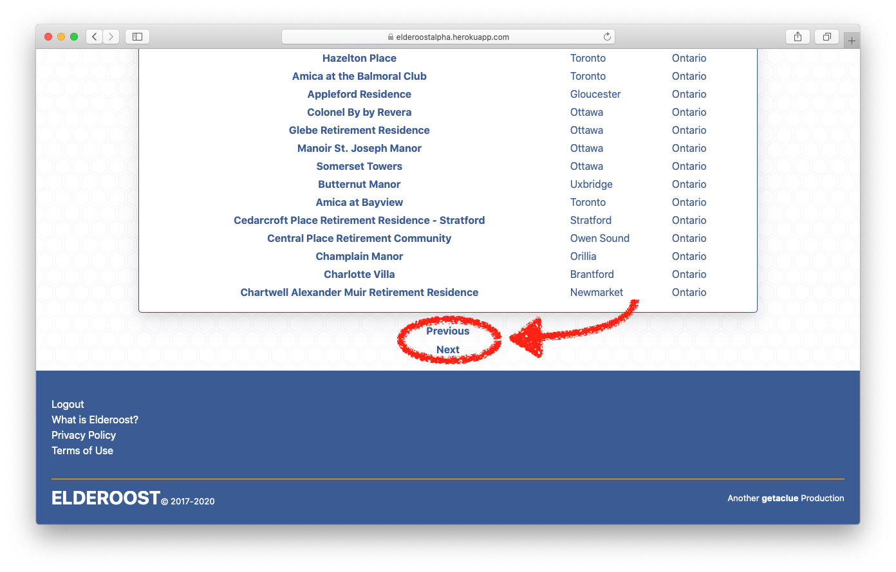

:::note [NOTE]
In this chapter I walk you through a small project that you can use to add pagination to any route that you like in your projects.
:::



The goal of this chapter is to show how one can go from a table UI showing lots of data points to a paginated table UI. To do this, I needed to check if my database supports `offset` and `limit` properties. What followed, was finding that , both, PostgresSQL and Sequelize support these parameters. I needed to create the code.

I did this by adding a new query in the url `?page=1` for the `/residences` page which indicates which page the user is browsing, starting with page 0. The default behaviour of this simple pagination feature is to browse the residences list one page at a time. If one were to try this feature, I think one would notice that either search or view map features offer better performance and quicker find-ability.

I made a deliberate decision when I opted to add `?page=1` to `/residences`. Thus, the proper url was now `/residences?page=1` and not just `/residences`.

This decision allows me to make the following code using the query.page property of the req object of the /residences route handler. In other words, here is what the code looks like :

```js title="/routes/residences.js"
// ...
router.get('/', async (req, res, next) => {
  try {
    const currentPage =
    req.query.page && Number(req.query.page) > 0 ? Number(req.query.page) : 0;
    const offset = currentPage \* 25;
    const prevPage = currentPage - 1 >= 0 ? currentPage - 1 : 0;
    const nextPage = currentPage + 1;
// ...

```

The code above is setting up the values of previous page, current page, and next page variable. In addition, I wanted my pages to contain 25 elements. So, my offset was calculate simply by the position of the `?page=1` parameter being multiplied by 25. In the code, I also check for the boundary of zero and if the value is below zero, I simply set the whatever value to zero. In my current code, we cannot have negative pages.

These parameters are then just passed to the page template. In the page template, they simply set the appropriate value for the previous and next pages. Please notice that in the following code I also calculate the number of total pages with the anticipation of future features that links to the last page.

```js title="/routes/residences.js"
// ...
const residences = await Residence.findAndCountAll({
  offset: offset,
  limit: 25,
});
const { count, rows } = residences;
const totalPages = count / 25;
const page = {
  prevPage,
  currentPage,
  nextPage,
  totalPages,
};
// ...
```

What comes next is simply passing all of this data down to the template like so

```js title="/routes/residences.js"
// ...
res.render('residences/index', {
  title: `Residences - Elderoost`,
  residences: rows,
  page: page,
});
// ...
```

Then I needed to glue all of the pieces together in the handlebarsjs template in the following way

```handlebars title="/views/residences/index.hbs"
{{#if page}}
<a href="/residences?page={{page.prevPage}}" class="main__wrapper__link">Previous</a>
<a href="/residences?page={{page.nextPage}}" class="main__wrapper__link">Next</a>
{{/if}}
```

and when I refreshed my `/residences?page=1` route I got my pagination function at the bottom of the screen just like in the chapter’s picture.
