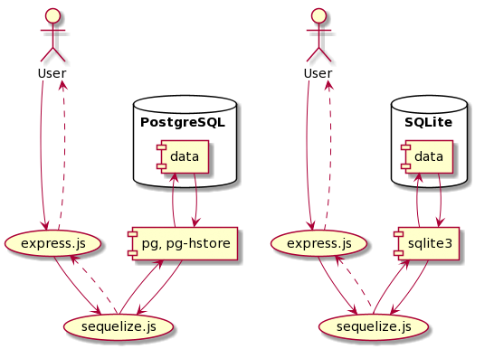
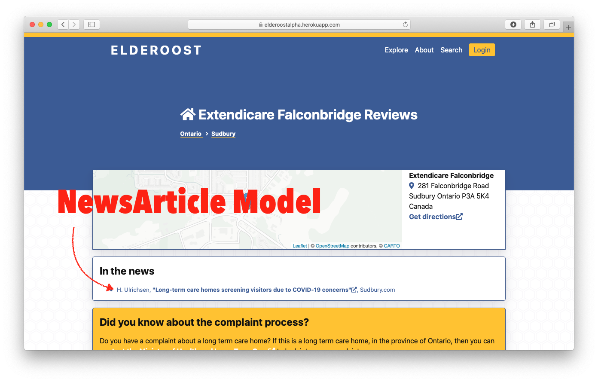
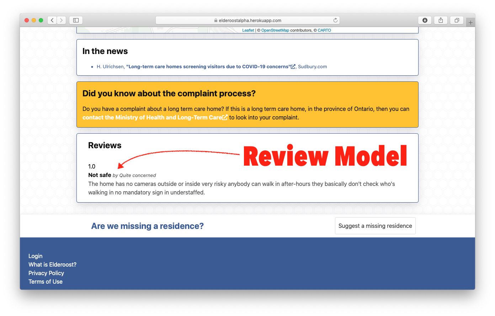

## Assumptions

:::note Docs,Sequelize API Reference, https://sequelize.org/v5/
Sequelize is a promise-based Node.js ORM for Postgres, MySQL, MariaDB, SQLite and Microsoft SQL Server.
:::

I assume that the database of choice, if different from [PostgreSQL](https://www.postgresql.org/), is setup. What is great about sequelize is that it does not care about your underlying database. If database is supported, then you can switch databases by adjusting the configuration file and your code will mostly work the same.



For this project, we will be using PostgreSQL database as our data storage. Moreover, we will use [TablePlus](https://tableplus.com/) to interact with the raw data. TablePlus software is great and it is available on Mac, Windows, and Linux platforms. For setup on a mac, I recommend you do it through the [Postgres.app](https://postgresapp.com/). For windows platform, I recommend you install the database using their [installer](https://www.postgresql.org/download/windows/).

## Configuration

```shell title="Install sequelize and the required postgresql modules"
npm install --save sequelize
npm install --save pg pg-hstore
```

Next, we need to describe where it is that our database is located and how to connect to it. I made a folder called `config` and a file for database `db.js`. In the file I wrote the following:

```js title=".config/db.js"
const Sequelize = require('sequelize');

var database = `postgres://getaclue@localhost:5432/elderoostalpha_dev`; //<1>
var sequelize = {};

if (process.env.NODE_ENV === 'production') {
  database = `${process.env.DATABASE_URL}`; //<2>
}

sequelize = new Sequelize(`${database}`);

module.exports = sequelize;
```

- <1> Default postgresql connector and location if installed using [Postgres.app](https://postgresapp.com/)
- <2> In production, I use environmental variables for my database url

The configuration above basically follows the readme of the [sequelize](https://sequelize.org/v5/manual/getting-started.html) project. We are injecting the sequelize project, then we are instantiating a sequelize object that will use postgresql as its database. We then glue our database code like the following code in the `app.js` file (our start file) :

```js {2,5,7,10} title=".app.js"
// ...
const sequelize = require('./config/db'); //<1>
// ...
sequelize
  .authenticate() //<2>
  .then(() => {
    console.log('Connection has been established successfully.'); //<3>
  })
  .catch((err) => {
    console.error('Unable to connect to the database:', err); //<4>
  });
// ...
```

- <1> Import sequelize as we have configured it in `./config/db.js`
- <2> Run the module and authenticate our connection
- <3> If everything works, then we get this message
- <4> Otherwise, we get this error message with the error

There, our database is connected and it is started every time our node.js application starts because the code is placed in our `app.js` file.

## Models

### models/user.js

To interact with the database, we better start off with modeling our data as per [sequelize](https://sequelize.org/v5/manual/getting-started.html) documents. I did it by creating the following file in the folder `models` :

```shell title="Create models/user.js"
mkdir models
cd models
touch user.js
```

With sequelize, you simply using their functions as they are outlined in the documentation to describe your data. I then created the following code in the `user.js` file. Since I was using underscored convention for my database structure, I set `underscored` to `true`. This makes it so that the column names are [snake cased](https://en.wikipedia.org/wiki/Snake_case). If this setting was left to false (default), sequelize follows JavaScript conventions for attributes: `residenceId` and not `residence_id` as I modelled it.

```js title=".models/user.js"
const Sequelize = require('sequelize'); //<1>
const sequelize = require('../config/db');
const User = sequelize.define(
  'user',
  {
    id: {
      type: Sequelize.UUID,
      allowNull: false,
      primaryKey: true,
      defaultValue: Sequelize.UUIDV4,
    },
    email: { type: Sequelize.STRING, allowNull: false, unique: true },
    username: { type: Sequelize.STRING, allowNull: false, unique: true },
    password: { type: Sequelize.STRING, allowNull: false },
    is_admin: {
      type: Sequelize.BOOLEAN,
      allowNull: false,
      defaultValue: false,
    },
    reset_password_token: {
      type: Sequelize.STRING,
      allowNull: true,
      unique: true,
    },
  },
  { underscored: true }
);
module.exports = User;
```

- <1> Sequelize module is imported to aid in model definition for the variable type

Finally, to test all of the code running together I need to interact with the database. I will do so by creating a seed file and running it locally. I use a similar approach for hard resets on my production. The seed file contains the bare minimum data to get the project up and running.

```shell
touch ../config/db.seed.js
```

In the seed file I want to connect to the database and add one user to the database (the administrator) and save it. After doing that, I want to run my project again to ensure that the connection to the database is established.

```js title=".config/db.seed.js"
const db = require('./db'); //<1>
const User = require('../models/user'); //<2>

const seed = async () => {
  await db.sync({ force: true }); //<3>

  const password = `M<gC4['Dqv}G''X"Tg5XDbVrmWR16/ca`;
  const username = 'getaclue';
  const email = 'info@getaclue.me';
  const reset_password_token = `eyJhbGciOiJIUzI1NiIsInR5cCI6IkpXVCJ9.eyJzdWIiOiIxIiwibmFtZSI6ImluZm9AZ2V0YWNsdWUubWUiLCJpYXQiOjE1MTYyMzkwMjJ9.\_lImbjluzsOJSy-hlDzEOasZRSd8YuQ_9hBmmCvSvp0`;

  User.create({
    password: password,
    email: email,
    username: username,
    reset_password_token: token,
    is_admin: true,
  })
    .then((user) => {
      //<4>
      console.log('seeded user', user);
    })
    .catch((error) => {
      console.error('failed to seed, ', error);
      db.close();
    });
};

seed();
```

- <1> Import database setup
- <2> Grab the user model representation
- <3> Reset the database by dropping all of the tables
- <4> Return the saved user data

:::note [INFO]

Whenever you run `database.sync({ force: true });` or `User.sync({ force: true });` all of the data will be dropped in the process. In the case of the database, all of the tables will be dropped before being re-created. In the case of `User` entity, only the `user` database will be dropped and re-created.
:::

Once everything is typed out, you can feel free to test everything once again. I ran the follow commands and made sure everything worked as expected.

```shell title="Test seed file followed by testing the overall connection"
node config/db.seed.js
node app.js
```

I have installed [sequelize](https://sequelize.org/v5/manual/getting-started.html) and postgreSQL in my ExpressJS project; established the connection between ExpressJS and the database via [sequelize](https://sequelize.org/v5/manual/getting-started.html); created User's table, added some data, and queried that data. From here on, steps like building out the api; authentication; and authorization can proceed.

### models/news_article.js



```js title=".models/news_article.js"
const Sequelize = require('sequelize');
const sequelize = require('../config/db');

const NewsArticle = sequelize.define(
  'news_article',
  {
    id: {
      type: Sequelize.UUID,
      allowNull: false,
      defaultValue: Sequelize.UUIDV4,
      primaryKey: true,
    },
    author_names: { type: Sequelize.STRING },
    headline: { type: Sequelize.STRING },
    publisher: { type: Sequelize.STRING },
    url: { type: Sequelize.STRING },
    status: {
      type: Sequelize.STRING,
      allowNull: false,
      defaultValue: `pending`,
    },
    publication_date: { type: Sequelize.DATE },
    retrieved_date: { type: Sequelize.DATE },
  },
  { underscored: true }
);

module.exports = NewsArticle;
```

### models/review.js



```js title=".models/review.js"
const Sequelize = require('sequelize');
const sequelize = require('../config/db');
const Residence = require('../models/residence');

const Review = sequelize.define(
  'review',
  {
    id: {
      type: Sequelize.UUID,
      allowNull: false,
      defaultValue: Sequelize.UUIDV4,
      primaryKey: true,
    },
    name: { type: Sequelize.STRING },
    author: { type: Sequelize.STRING },
    rating_value: { type: Sequelize.DECIMAL, allowNull: false },
    description: { type: Sequelize.TEXT, allowNull: false },
    status: {
      type: Sequelize.STRING,
      allowNull: false,
      defaultValue: `pending`,
    },
    author_email: { type: Sequelize.STRING, allowNull: false },
    notify: { type: Sequelize.BOOLEAN, allowNull: false, defaultValue: false },
    accepted_terms: {
      type: Sequelize.BOOLEAN,
      allowNull: false,
      defaultValue: false,
    },
  },
  { underscored: true }
);

module.exports = Review;
```

### models/residence.js

```shell title="Create models/residence.js"
cd models
touch residence.js
```

and then we go on to create our model

```js title=".models/residence.js"
const Sequelize = require('sequelize');
const sequelize = require('../config/db');
const NewsArticle = require('./news_article'); //<1>
const Review = require('./review');
const Residence = sequelize.define(
  'residence',
  {
    id: {
      type: Sequelize.UUID,
      allowNull: false,
      defaultValue: Sequelize.UUIDV4,
      primaryKey: true,
    },
    name: { type: Sequelize.STRING, allowNull: false },
    alternate_name: { type: Sequelize.STRING },
    description: { type: Sequelize.TEXT },
    latitude: { type: Sequelize.DECIMAL },
    longitude: { type: Sequelize.DECIMAL },
    address: { type: Sequelize.STRING, allowNull: false, unique: true },
    url: { type: Sequelize.STRING },
    status: { type: Sequelize.STRING, defaulValue: 'pending' },
    address_num: { type: Sequelize.INTEGER },
    address_street: { type: Sequelize.STRING },
    address_state: { type: Sequelize.STRING },
    address_city: { type: Sequelize.STRING },
    address_country: { type: Sequelize.STRING },
    postal_code: { type: Sequelize.STRING },
    slug: { type: Sequelize.STRING, unique: true },
    address_city_slug: { type: Sequelize.STRING, allowNull: false },
    address_state_slug: { type: Sequelize.STRING, allowNull: false },
  },
  { underscored: true }
);

Residence.hasMany(NewsArticle, { foreignKey: 'residence_id' }); //<2>
NewsArticle.belongsTo(Residence);
Residence.hasMany(Review, { foreignKey: 'residence_id' });
Review.belongsTo(Residence);

module.exports = Residence;
```

- <1> Import `NewsArticle` and `Review` models so that associations can be built with `Residence`
- <2> Build associations with `Residence` and other entities

## Migrations

While this project is feature complete at the moment, the database may change in the future. One approach for dealing with database changes is simply to make a backup of the database and run `sync({force:true})` to rebuild the database with new changes. Doing the process this way may work but will require some patching throughout the growth of database changes.

A different approach for dealing with database changes over time is to use a migration mechanism. While `sequelize` does not come with this mechanism built in, it does have one through the usage of `sequelize-cli` node module.

:::note [INFO]
Read more about migrations here :

- https://sequelize.org/v5/manual/migrations.html
- and https://github.com/sequelize/cli

:::
